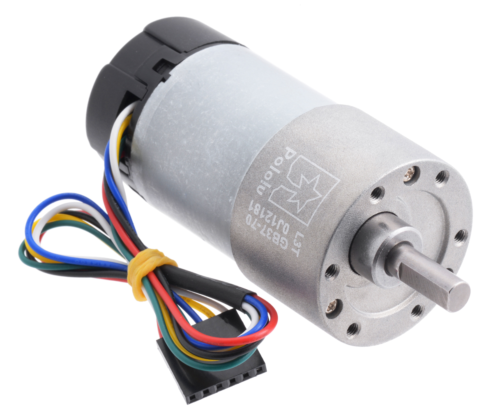
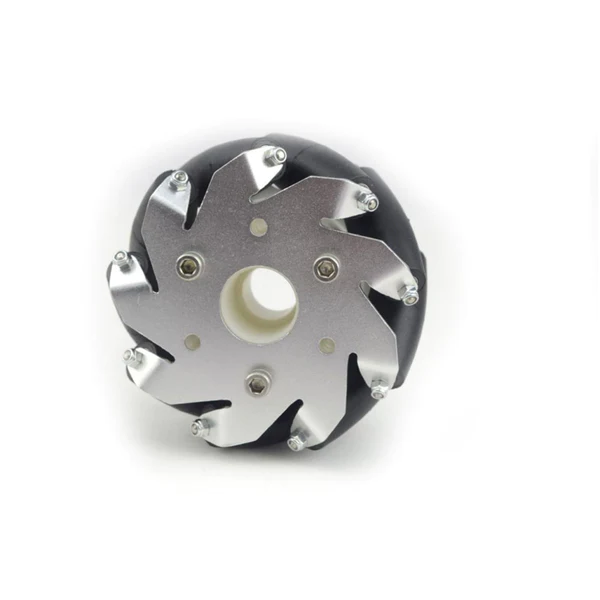
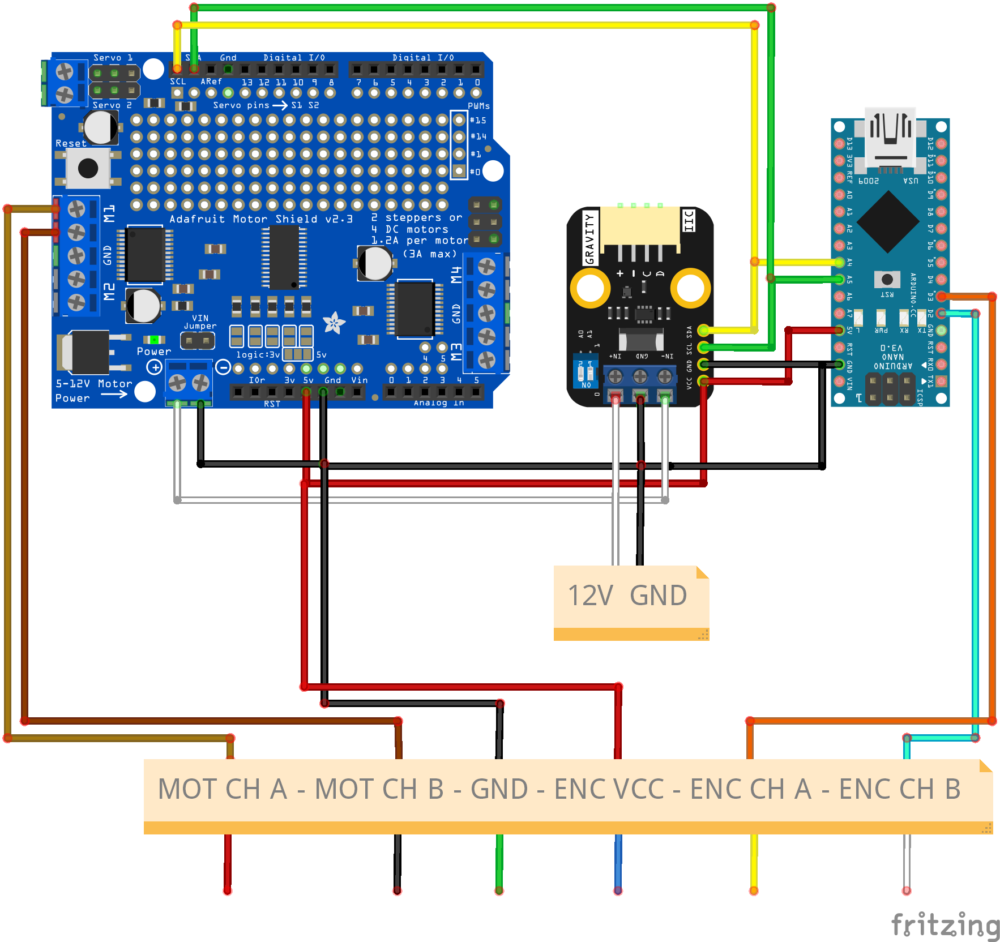

# Identification of a DC Motor in State Space with Simulink

## Componentes previos

Queriamos identificar el siguiente motor, Pololu Metal Gearmotors - 70:1 Metal Gearmotor 37Dx70L mm 12V with 64 CPR Encoder (https://www.pololu.com/product/4754/specs), este motor cuenta con una reductora de 70 a 1 con varios engranajes.

El modelo que vamos a emplear esta resumido por Paulo Loma Marconi en su blog, enlaces abajo, esta explicado en detalle en el libro dado como refencia. En la carpeta docs podemos encontrar una copia en Español e Inglés.
### Modelo de referencia - Reference model
**Español:**
https://paulomarconi.github.io/es/blog/DCmotor/

**Ingles:**
https://paulomarconi.github.io/blog/DCmotor/

El motor al final del eje tiene cogido al eje un rueda mecanum de 100 mm de diametro y 50 mm de ancho. (https://eu.robotshop.com/es/products/100mm-mecanum-wheel-set) como la de la siguiente imagen.

Pongamos manos a la obra, para la identificación del modelo vamos a utilizar el siguiente circuito y librerias. El esquematico esta realizado con un herramienta llamada Fritzing.

El circuito es sencillo tenemos un driver para controlar el motor, en este caso, Adafruit Motor Shield V2, un microcontrolador como un Arduino Nano, podría ser cualquier otro, para acelerar el proceso se recomienda un micro que tenga ya las liberias implementadas para los sensores que vayamos a utilizar. Por último, tenemos un Vatímetro como el Gravity: I2C Digital Wattmeter, con este podemos medir voltaje e intensidad consumida. Ambos sensores funcionan a través de I2C lo cual permite una fácil adapatación y uso en cualquier MCU o single board computer como Raspberry.

- Adafruit Motor Shield V2 - https://learn.adafruit.com/adafruit-motor-shield-v2-for-arduino/overview
- Gravity: I2C Digital Wattmeter de DFRobot - https://wiki.dfrobot.com/Gravity:%20I2C%20Digital%20Wattmeter%20SKU:%20SEN0291